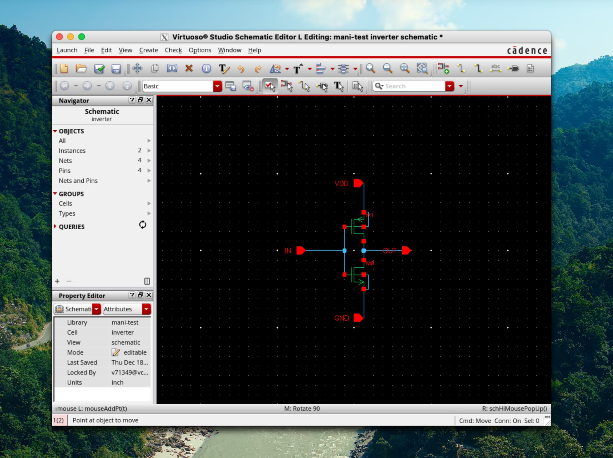

# analog-gradients

Building a GPU from transistors up—with AI doing the heavy lifting.

## The Story

Coding is just becoming ever easier. With AI, I've been tackling increasingly complex projects. So I thought: why not try something truly ambitious? I wanted to design a GPU.

The first step was figuring out *how* you even design GPUs. That led me down a rabbit hole into the EDA software industry—a sector of the semiconductor supply chain I knew nothing about, but one that turns out to be critically important. You can't design chips without these tools. Companies like Cadence and Synopsys have decades of compounding expertise baked into their software. There's no real alternative.

### Getting Access (The Hard Part)

I wanted to work with this software. The problem? These tools cost thousands of dollars per year just to *license*—you don't even own anything. With some research, I found CMC Microsystems, a Canadian institution that provides academic access to EDA tools. I reached out to professors, got pointed to the right people, and eventually got a faculty sponsor for my university's CMC subscription.

This was genuinely the hardest part of the whole project. Not the technical work—just getting through the gate.

### The AI-Assisted Approach

Once I had access to the CMC Cloud machine, I was overwhelmed. The number of tools, scripts, and workflows was absolutely insane. I had no idea where to start.

So I installed Claude Code on that machine.

From there, things moved fast. Experimenting with Cadence Virtuoso, I connected a PMOS and NMOS together through the GUI to make an inverter—my first circuit, built by hand.



That's a milestone because *everything* is downstream of that. Just two transistors, but they're the foundation for everything that follows.

### The Vision: Bottom-Up

The idea was simple: build complex components from basic building blocks.

```
PMOS + NMOS → Inverter → NAND/NOR → Logic Gates → Adders → ALU → GPU Core
```

Each level uses only what was built in the level below. No magic, no abstractions you don't understand—just transistors all the way down.

I asked the AI to do exactly that. My job was coming up with the idea, knowing where I wanted the project to go, and being willing to delegate. The actual implementation? Claude and Codex handled it.

### Two Nights

I'll be honest: this was done in two nights of scattered effort. A project that would have taken me weeks or months of learning EDA tooling, understanding SPICE netlists, writing verification scripts—compressed into a couple of evenings.

It's a new age we're diving into.

---

*Built with the help of Claude (Anthropic) and Codex (OpenAI).*

---

## Quick Start

```bash
source setup_cadence.sh
./build.sh all
```

For auditable full runs, use the generated files under `results/_runlogs/`
(`build_all_<timestamp>.log` and `.manifest.txt`).

## Start Here

- Knowledgebase index (source-of-truth root): `my-workspace/docs/INDEX.md`
- Vision: `my-workspace/docs/vision.md`
- Development playbook: `my-workspace/docs/DEVELOPMENT.md`
- Technical status: `my-workspace/docs/STATUS.md`
- Competition strategy packet: `competition/README.md`

## Repository Structure

```
analog-gradients/
├── AGENTS.md             # Agent instructions
├── CLAUDE.md             # Claude-specific context
├── README.md             # This file
├── setup_cadence.sh      # Cadence environment (bash)
├── build.sh              # Build and test runner
├── netlists/             # Spectre simulation files (.scs)
├── ocean/                # OCEAN verification scripts (.ocn)
├── skill/                # Virtuoso SKILL scripts (.il)
├── scripts/              # Automation helpers
├── results/              # Simulation outputs + verification reports
├── competition/          # ICTGC strategy + source docs
└── my-workspace/         # Knowledgebase, tickets, logs
```

## Docs & Tracking

- Knowledgebase index: `my-workspace/docs/INDEX.md`
- Status: `my-workspace/docs/STATUS.md`
- Vision: `my-workspace/docs/vision.md`
- GPU spec: `my-workspace/docs/gpu-spec.md`
- Tickets: `my-workspace/tickets/`
- Logs: `my-workspace/logs/`

## Results Policy

- Commit: `results/*_test.txt` and `results/inverter_verify.txt`
- Do not commit: raw waveforms/logs (`results/**/*.raw/`, `spectre.log`,
  `ocean.log`, run logs/manifests)
- See `results/README.md` for full policy.
